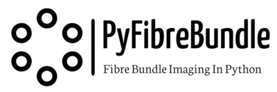

[](https://github.com/MikeHughesKent/pyfibrebundle/actions/workflows/tests.yml)

[](https://opensource.org/licenses/MIT)

<h1 align="right">

</h1>

# PyFibreBundle

PyFibreBundle is a Python package for processing images captured through optical fibre bundles. 

The core functionality allows fibre core patterns to be identified and removed by several methods, in addition to background subtraction, flat-fielding (normalisation), and cropping via automatical bundle localisation. Modules also allow for mosaicking and resolution enhancement.

PyFibreBundle is fast enough for live imaging as well as for offline research; frame rates of over 100 fps 
can be achieved on mid-level hardware, including core removal and mosaicing. The Numba just-in-time compiler is used to accelerate key portions of code (particularly triangular linear interpolation) 
and OpenCV is used for fast mosaicing. If the Numba package is not installed then PyFibreBundle falls back on Python interpreted code.

The package was originally developed mostly for applications in endoscopic microscopy, including fluorescence endomicroscopy and 
holographic endomicroscopy, but there are also potential applications in endoscopy, industrial inspection etc.

[Join the mailing list](https://groups.google.com/g/pyfibrebundle) to hear about releases, updates and bug fixes.

## Documentation

Read the [full documentation](http://PyFibreBundle.readthedocs.io).

## Example Notebooks
These can be run online on Binder:
- Triangular Linear Interpolation [](https://mybinder.org/v2/gh/MikeHughesKent/PyFibreBundle/HEAD?urlpath=%2Fdoc%2Ftree%2Fnotebooks%2Ftriangular_linear_interp.ipynb)
- Resolution Enhancement [](https://mybinder.org/v2/gh/MikeHughesKent/PyFibreBundle/HEAD?urlpath=%2Fdoc%2Ftree%2Fresolution_enhancement.ipynb)
- Mosaicing [](https://mybinder.org/v2/gh/MikeHughesKent/PyFibreBundle/HEAD?urlpath=%2Fdoc%2Ftree%2Fnotebooks%2Fmosaicing.ipynb)

## Journal Paper

The package is described in this paper, please cite it when using PyFibreBundle for academic work, as well as providing a link to this repository:

M. Hughes, _Real-timing processing of fiber bundle endomicroscopy images in Python using PyFibreBundle_, Applied Optics **62**(34), 9041-9050 (2023). [Link](https://doi.org/10.1364/AO.503700)


## Getting Started

There are three ways to get PyFibreBundle:
* Download the [latest stable release](https://github.com/MikeHughesKent/PyFibreBundle/releases/latest) from github and unzip. This will give you all the examples,
tests and test data. 
* Clone the github repository using git. This will give you the latest updates but more chance of bugs.
* Install the latest stable release using:

```
pip install PyFibreBundle 
```

The third option (using pip install) should find and install all the dependencies. For the other two options
you will need to either manually check you have the requirements installed, 
or navigate to the PyFibreBundle folder on your machine and run:

```
pip install -r requirements.txt
```
to install the dependencies. You may wish to create a virtual environment using Conda/venv first to avoid conflicts with your existing python setup.

Note that the pip install doesn't include the examples and tests which still need to be downloaded from Github. 

Once installed, you can try running the [examples](https://github.com/MikeHughesKent/PyFibreBundle/tree/main/examples).

## Feature List

### Core Functions  
* Supports monochrome and multi-channel (e.g. colour) images.
* Locate bundle in image.
* Crop image to only show bundle.
* Mask areas outside of bundle.
* Determine core spacing.
* Find locations of all cores in bundle.
* Core removal by Gaussian filtering.
* Core removal using custom edge filtering.
* Core removal using triangular linear interpolation following Delaunay triangulation. 

### Mosaicing
* Detect image to image shift using normalised cross correlation.
* Insert image into mosaic either using dead-leaf or alpha blending.
* Expand or scroll mosaic when the edge of the mosaic image is reached.

### Super Resolution
* Combine multiple shifted images to improve resolution.

## Requirements

Required Packages:

* Numpy
* OpenCV
* Pillow
* Scipy

Optional Packages:

* Numba (for faster linear interpolation)
* Matplotlib (to run examples and tests)

## Contributions
Development is led by [Mike Hughes](https://research.kent.ac.uk/applied-optics/hughes) 
at the [Applied Optics Group](https://research.kent.ac.uk/applied-optics/), Physics & Astronomy, University of Kent. 

Bug reports, contributions and pull requests are welcome. Academic collaborations are welcomed and consultancy is available
for potential commercial users, [get in touch](mailto:m.r.hughes@kent.ac.uk)

Thanks to: Cheng Yong Xin, Joseph, who contributed to triangular linear interpolation; Callum McCall who contributed to the super resolution component, Petros Giataganas who developed some of the Matlab code that parts of this library were ported from. 

The work was partly funded by EPSRC (Ultrathin fluorescence microscope in a needle, EP/R019274/1), the Royal Society (Ultrathin Inline Holographic Microscopy) and University of Kent.
